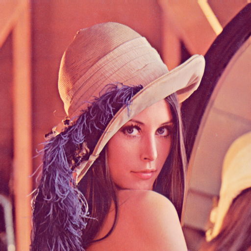

## image processing algorithms in C++

This repository contains some algorithms for image processing, coded from scratch.

# Specifications

You will need OpenCV for C++ installed in your computer.

# Content

 

